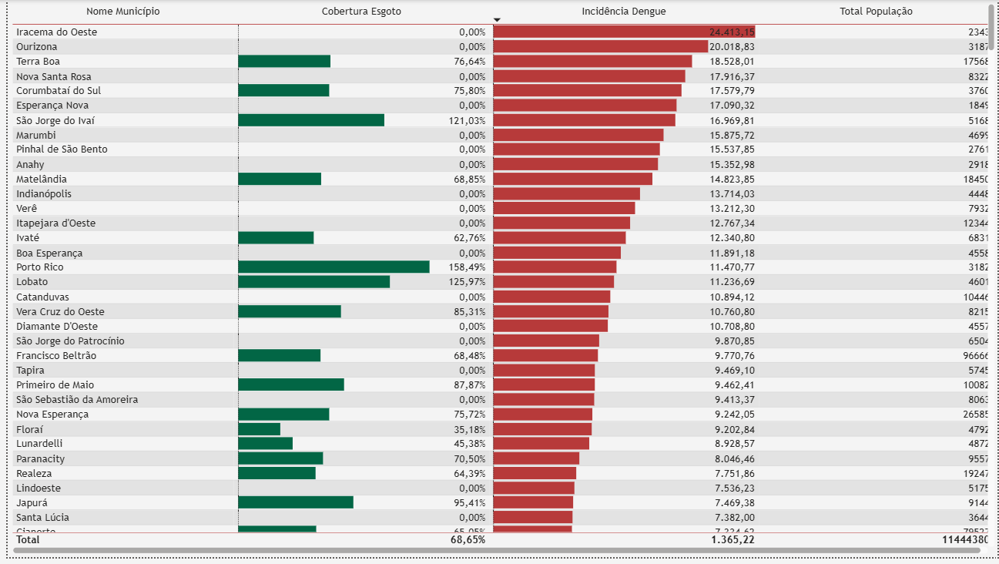

# Data Analysis & BI Dashboard – Dengue & Sanitation in Paraná (Brazil)

## Overview
This project analyzes the relationship between **dengue incidence**, **sanitation infrastructure** and **population data** across municipalities in Paraná, Brazil.

The focus was on transforming raw public datasets into **clean, structured and analyzable data**, applying normalization rules, filters and business logic before building interactive dashboards in Power BI.

---

## Data Preparation & Modeling
- Cleaned and standardized raw datasets using **Excel and SQL**
- Applied **normalization rules** to ensure consistency across sources
- Removed redundancies and handled missing or inconsistent values
- Designed and implemented a **Star Schema data model** (fact and dimension tables)
- Integrated multiple datasets (health, population and sanitation infrastructure)

---

## Dashboard & Analysis
- Created interactive **filters and slicers** to support dynamic analysis
- Built KPIs, rankings and geographic visualizations
- Analyzed correlations between sewage coverage and dengue incidence
- Enabled drill-down analysis at regional and municipal levels
- Applied **data storytelling** principles to highlight patterns and outliers

---

## Tech Stack
- **Power BI** (data modeling, DAX, filters, dashboards)
- **SQL** (data cleaning, normalization, star schema, joins)
- **Excel** (data preparation and formatting)
- Public datasets (IBGE and public health data)

---

## Dashboard Highlights
- Dengue incidence ranking by health region
- Correlation analysis between sanitation coverage and dengue cases
- Geographic distribution of cases across Paraná
- Detailed municipal-level analysis with interactive filters

---

## Screenshots

---

## Notes
To explore the dashboard:
1. Download the `.pbix` file from the `/dashboard` folder
2. Open it using Power BI Desktop
